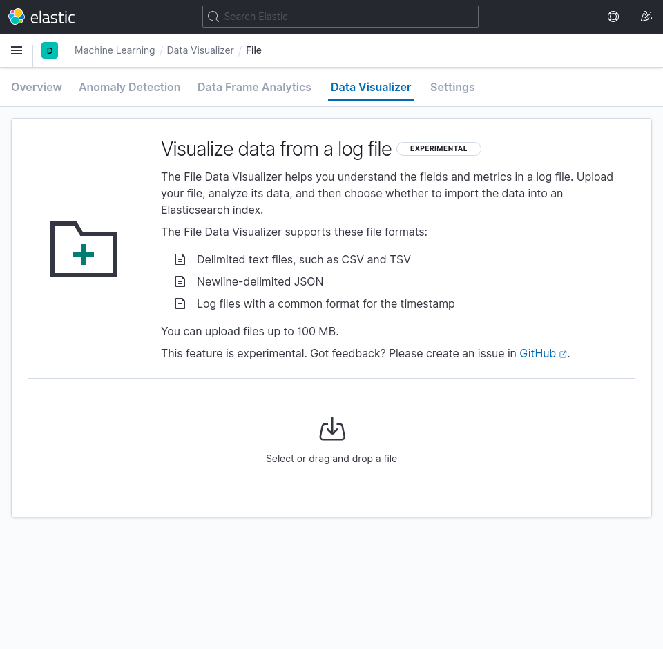
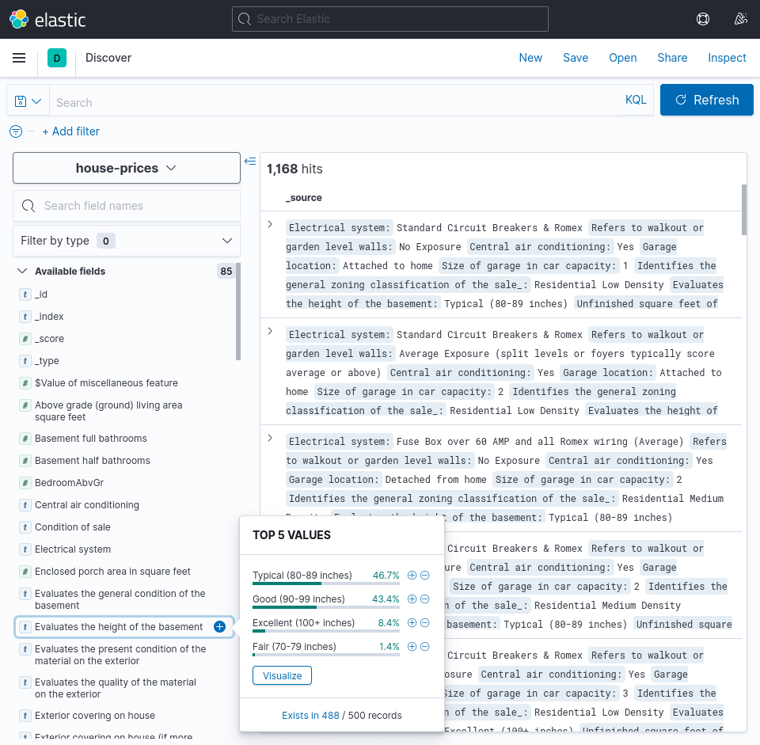

# Visualize House Prices in Kibana

I stumbled upon the article
[Machine Learning Project – How to Analyze and Clean Data, Create an ML Model, and Set Up an API](https://www.freecodecamp.org/news/data-science-and-machine-learning-project-house-prices/)
by Renan Moura Ferreira on freeCodeCamp
in which he explains the process of analyzing a dataset, cleaning it up, and applying machine learning to it.

It is based on the
[House Prices - Advanced Regression Techniques](https://www.kaggle.com/c/house-prices-advanced-regression-techniques/overview)
competition on Kaggle.

As the name of the competition suggests, the dataset is about houses and contains many characteristics about each house.

The goal of this project is to show how the dataset can be visualized with Kibana.

The `house-prices.csv` file contains the data that will be used in this project. It is based on the `raw_data.csv` file from the [https://github.com/renanmouraf/data-science-house-prices](https://github.com/renanmouraf/data-science-house-prices) repository.
The `house-prices.csv` file has been generated by applying the `translate_columns_and_values.py` Python script to the `raw_data.csv` file, which replaces short column names and values with more detailed explanations defined inside the `data_description.txt` file, which is from the [https://github.com/swaathi/eda](https://github.com/swaathi/eda) repository.

The end result is a Dashboard that looks like this.


## Steps

### Clone repository

Open a terminal and type the following.

```bash
git clone https://github.com/danielwohlgemuth/visualize-house-prices-in-kibana
```

Navigate into the cloned repository.

```bash
cd visualize-house-prices-in-kibana
```


### Start Docker containers

This projects uses Docker to run Elasticsearch and Kibana. If you don't have it, you can look at
[https://docs.docker.com/desktop/](https://docs.docker.com/desktop/)
on how to get it. You'll need Docker Engine and Docker Compose, so if you install Docker Desktop, both are included.

To begin, start the Docker containers, defined in the `docker-compose.yml` file.

On the first run, this will download the Docker images for Elasticsearch and Kibana, which weight around 900MB together, so it could take some time.

```bash
docker-compose up -d
```

The `-d` argument makes the containers start in the background.


### Import dataset

Navigate to
[http://localhost:5601/app/ml/filedatavisualizer](http://localhost:5601/app/ml/filedatavisualizer).

Upload the `house-prices.csv` file.



At this point you can already see some of the top values for different columns from the first 1000 lines.

Click `Import`.


Select `Advanced`.

Set the index name to `house-prices`.

Replace the mappings where properties have a type `text` with `keyword`, to make analysis on those fields posible. You can either replace them by hand (13 times) or copy the content of the `mappings.json` file and overwrite the whole `Mappings` field.

Scroll down and click `Import` again.


At this point you can begin exploring the dataset by navigating to
[http://localhost:5601/app/discover](http://localhost:5601/app/discover).




### Import dashboard

Navigate to
[http://localhost:5601/app/management/kibana/objects](http://localhost:5601/app/management/kibana/objects)

Click `Import`. This opens a side menu, in which you select the `export.ndjson` file and click `Import` below.


Navigate to
[http://localhost:5601/app/dashboards#/view/5ce98510-82c8-11eb-91c4-3bd89c5a5e78](http://localhost:5601/app/dashboards#/view/5ce98510-82c8-11eb-91c4-3bd89c5a5e78)
to see the dashboard.


You can also go to [http://localhost:5601/app/visualize](http://localhost:5601/app/visualize) and see how the individual visualizations of the dashboard have been made.


### Stop Docker containers

Note: This removes the containers and all of its data. If you want to keep the changes you made, you can export it under [http://localhost:5601/app/management/kibana/objects](http://localhost:5601/app/management/kibana/objects).

```bash
docker-compose down
```
